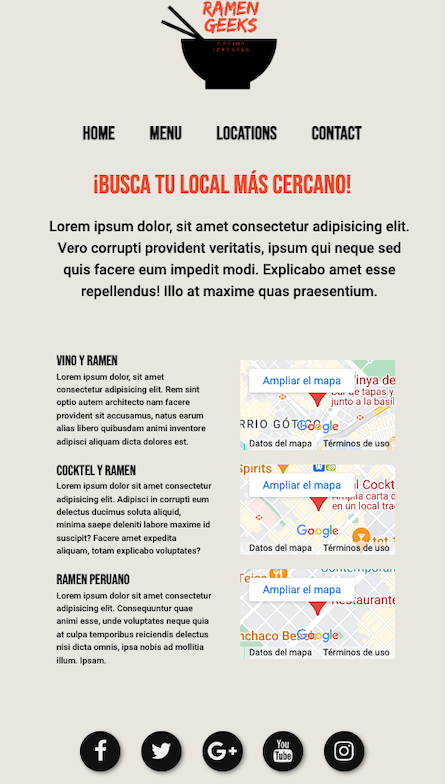
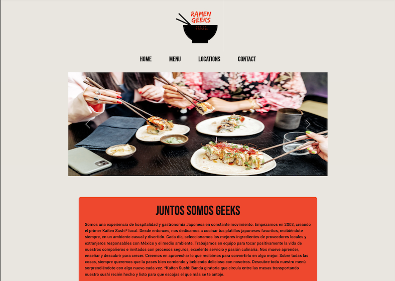

# Ramen Geeks  🚀
_Página de un restaurante de comida asiática._

***

### Pre-requisitos 📋
_Se puede ver en cualquier navegador web._
***
### Instalación 🔧

_Solo tienes que hacer click en el siguiente link....._

https://ibralzuru.github.io/RamenGeeks/
***
### Pruebas ⚙️

_En este proyecto se puede ver la adapatación responsiva a todo tipo de pantallas, tales como: móvil, tablet y ordenador. 
Os enseño algunos ejemplos:_

***

### Para esta web utilice los siguientes lenguajes:🛠️

* Html5
* Css
* JavaScript
* Bootstrap

***

### Autor ✒️

Ibralzuru

## Mención Especial para: 🎁

* La Clase Geeks Barcelona 🍺 
* Los profesores 📢
* etc..... 🤓

## Con ❤️ Ibra Alzuru C.

